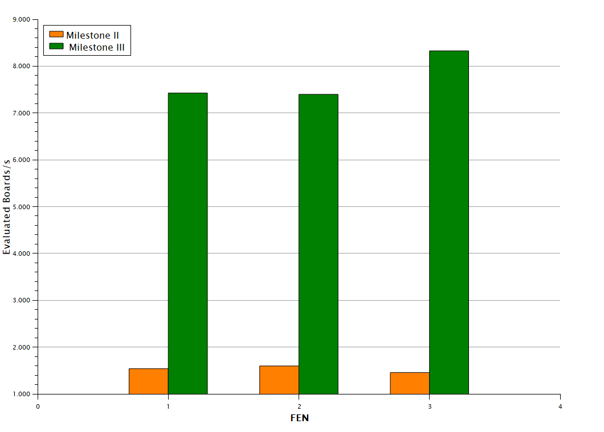

# Milestone III Documentation

## Refactoring and improvements

- Implemented numpy for several evaluation functions
- Replaced deepcopy with pickle to temporarely copy the board
- Fixed wrong check and checkmate moves
- Optimized and removed lots of unnecessary board copies
- Overall cleanup of the code

### Comments
Cleaning up the code helped us a lot with refactoring and some debugging. The cleanup mainly included removing lots of unnecessary comments, code for testing purposes or even code which didn't serve any purpose anymore.

Even though not as much as expected, implementing numpy to cut out many ressource intensive `for` loops in our evaluate function saved quite some time for generating moves.
We achieved this by passing the `board` class into the evaluation function and then converting the board list into a numpy array. This allowed us to remove the `for` loops and replace them with array masks and calculations.

After also replacing `deepcopy` with `pickle`, we were able to drastically increase the speed of our move generation, which was a great achievement. More detailed speed comparisons will be shown later in the documentation. 

After refactoring our `make_move()` function we fixed a lot of illegal moves. Unfortunately, we haven't been able to determine why the engine still generates **197,742/197,281** moves at depth 3. We will hopefully be able to fix this in the last milestone.

We also did some smaller refactoring in the `alphabeta.py` search. This increased the search speed, but didn't have as big of an impact as the move copy refactoring did.

## New implementations

- Move sorting
- Null-move heuristic
- time-management
- improvement of evaluation function

### Comments
With the implementation of move sorting, we were able to reduce the total tree size when doing the alpha beta search. This slightly improved the search speed and didn't have any impact on the move decision itself.

Adding the null-move heuristic increased the speed quite a lot. Although we had some trouble adding it to the existing code it should now work properly. It would have been easier if we would have used it from the beginning.

We now finally included a working time-management which unfortunately isn't that helpful because our alpha-beta algorithm uses depth first search. When the time limit is reached not all of the first moves in the tree have been evaluated yet.

We added a lot of new features in `evaluate_np.py`.
1. Isolated and connected pawn evaluation
2. Mid-Game piece values
3. Double pawn evaluation 

We added a mid-game piece position evaluation in order to change the strategy of the algorithm depending to the current game stage. 
We worked on a better evaluation specifically for pawns because bad pawn structures can be critical to a chessgame if not taken into account.

The evaluation function should now theoratically be a lot better than before. Unfortunately, while working on the new features, we encountered new bugs, so the quality of the move decision is not as good as we had hoped.
To analyze the full power of our algorithm we will focus on fixing those bugs in milestone IV.

## Benchmark

For testing the results :
- AMD Ryzen 5 3600X
- RTX 3070
- 16GB DDR4

In order to visualize the effectiveness of our changes to the chess engine, we compared the amount of evaluated boards per second for both milestone II and milestone III.

    
     
    Figure 1: Comparing the evaluated boards/s in milestone II and milestone III with depth 3 and different FEN.
   
    FEN 1: rnbqkbnr/pppppppp/8/8/8/8/PPPPPPPP/RNBQKBNR w KQkq - 0 1
   
    FEN 2: 3r1rk1/p1p1qp1p/1p2b1p1/6n1/R1PNp3/2QP2P1/3B1P1P/5RK1 w - - 0 1
   
    FEN 3: 3r4/7p/2p2kp1/2P2p2/3P4/2K3P1/8/5R2 b - - 0 1

Figure 1 illustrates a significant disparity in speed between milestone II and milestone III, visualizing the effectiveness of our implemented refactoring and new features.
We unfortunately weren't able to compare the speeds to 
